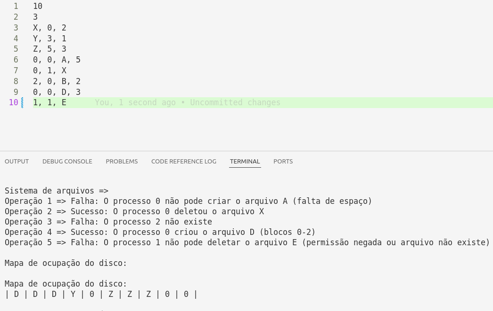
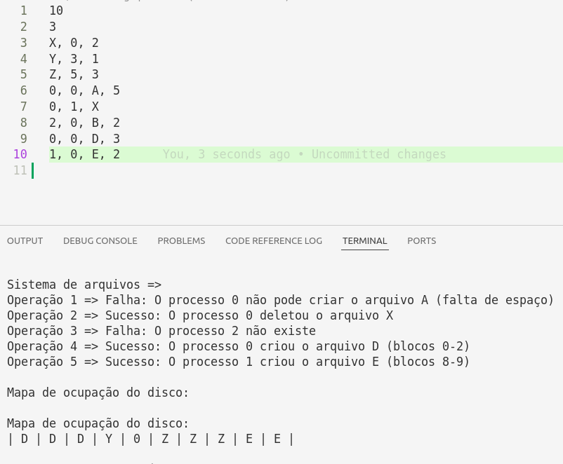

# Nota
Comparado ao arquivo `files.txt` da especificação, houve uma alteração: 
A operação 5 foi substituída por um delete, como esperado no exemplo de saída da especificação
 

Ao invés do create que estava no `files.txt` original. Segue a saída com o mesmo.
 


# Pseudo-Sistema Operacional

Este projeto implementa um **pseudo-sistema operacional multiprogramado** em Python, capaz de gerenciar **processos**, **memória**, **recursos de E/S** e um **sistema de arquivos** simples.

---

## ▶️ Como Executar

Para executar o sistema, utilize o `dispatcher.py` como script principal, passando os arquivos de configuração como argumentos na linha de comando:

```bash
python dispatcher.py processes.txt files.txt
```

---

### Projeto desenvolvido para a disciplina Fundamentos de Sistemas Operacionais — Universidade de Brasília (UnB)

Luana Cruz — 202033543  
Lucas de Oliveira — 200022857  
Regina Emy — 190037351


----

## 📝 Entrada

### `processes.txt`
Estrutura esperada:
Cada linha representa um processo com os seguintes campos (separados por vírgulas):
```
tempo_inicializacao, prioridade, tempo_processador, blocos_memoria,
num_impressora, req_scanner, req_modem, num_disco
```
sendo:

- tempo_inicializacao: Momento de início do processo (unidades de tempo) - Inteiro ≥ 0

- prioridade:

    0 = Processo de tempo real (prioridade máxima)

    1 = Usuário (prioridade mais alta)

    2-3 = Usuário (prioridades menores)

- tempo_processador: Tempo total de CPU necessário - Inteiro > 0

- blocos_memoria:

    1-64 blocos para processos de tempo real

    1-960 blocos para processos de usuário

- num_impressora:

    0 = Não utiliza impressora

    1-2 = Número da impressora requisitada (sistema tem 2)

- req_scanner:

    0 = Não utiliza scanner

    1 = Requer scanner (sistema tem 1)

- req_modem:

    0 = Não utiliza modem

    1 = Requer modem (sistema tem 1)

- num_disco:

    0 = Não utiliza disco

    1-2 = Número do disco SATA requisitado (sistema tem 2)

### `files.txt`
Estrutura:
1. Primeira linha: número total de blocos no disco
2. Segunda linha: número de arquivos pré-existentes
3. Linhas seguintes (arquivos pré-existentes):  
   `nome, bloco_inicial, num_blocos`
4. Linhas restantes (operações):  
   `pid, codigo_operacao, nome_arquivo, num_blocos`  
   onde:  
   `0 = criar arquivo`, `1 = deletar arquivo`